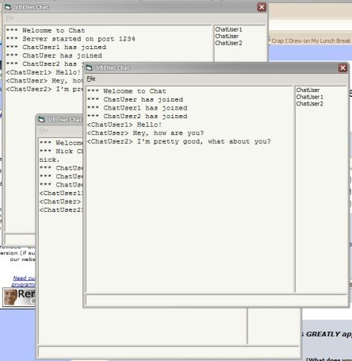

<div align="center">

## VBENet Easy\-To\-Use High Performance UDP Networking Library


</div>

### Description

VBENet is a VB wrapper for the open source ENet networking library. ENet is a simple, high-performance networking library that makes it easy to build fast, simple, reliable multiplayer software - it's great for multiplayer games, chats, and similar applications.
 
### More Info
 
VBENet is very simple to use. You can create a server in as little as two lines of code, and connecting to a server is equally as easy. Everything is wrapped in clean, easy to use VB classes, so you don't have to touch any nasty C structs or make API calls. VBENet also includes a useful 'time synchronizer' class that can be used to automatically determine the amount of time it takes to transmit data between machines. You can use this class to synchronize two clocks, or to automatically adjust for latency in time-based code - very useful when developing time-sensitive applications like games!

Included in this ZIP is the source code to a DLL version of the ENet library that has been modified to work with Visual Basic, along with the source code to the VBENet ActiveX DLL, and a simple chat demonstration client/server.

VBENet exposes a simple set of 3 events to notify you of connections, disconnections, and recieved information. Each connection exposes a small set of useful properties with information like connection latency and address.


<span>             |<span>
---                |---
**Submitted On**   |2005-04-12 07:54:26
**By**             |[Kevin Gadd](https://github.com/Planet-Source-Code/PSCIndex/blob/master/ByAuthor/kevin-gadd.md)
**Level**          |Intermediate
**User Rating**    |5.0 (10 globes from 2 users)
**Compatibility**  |VB 5\.0, VB 6\.0
**Category**       |[Internet/ HTML](https://github.com/Planet-Source-Code/PSCIndex/blob/master/ByCategory/internet-html__1-34.md)
**World**          |[Visual Basic](https://github.com/Planet-Source-Code/PSCIndex/blob/master/ByWorld/visual-basic.md)
**Archive File**   |[VBENet\_Eas1875894122005\.zip](https://github.com/Planet-Source-Code/kevin-gadd-vbenet-easy-to-use-high-performance-udp-networking-library__1-59972/archive/master.zip)

### API Declarations

```
Includes mdlENet.bas with all necessary API declarations.
If you can't compile the necessary ENet library yourself, a pre-compiled version is available. See the included readme for information.
```


